# Week 2 Lab Report - Remote Access

## Install Visual Studio Code
- Download and Install VSCode
    - Go to [Visual Studio Code website](https://code.visualstudio.com/), download and install the appropriate version of VS Code (macOS vs. Windows x64 vs. Linux x64)
        - On macOS, it should be a '.zip' file. After unzipping it, the "Visual Studio Code" app will appear in the folder.
- Open the VS Code app
    - The window should look like the images shown below, but color, theme, toolbar, etc. could be different due to personal settings.
    - *Since I have downloaded VScode before, the welcome page is not empty. It should be different when you first download it.*
    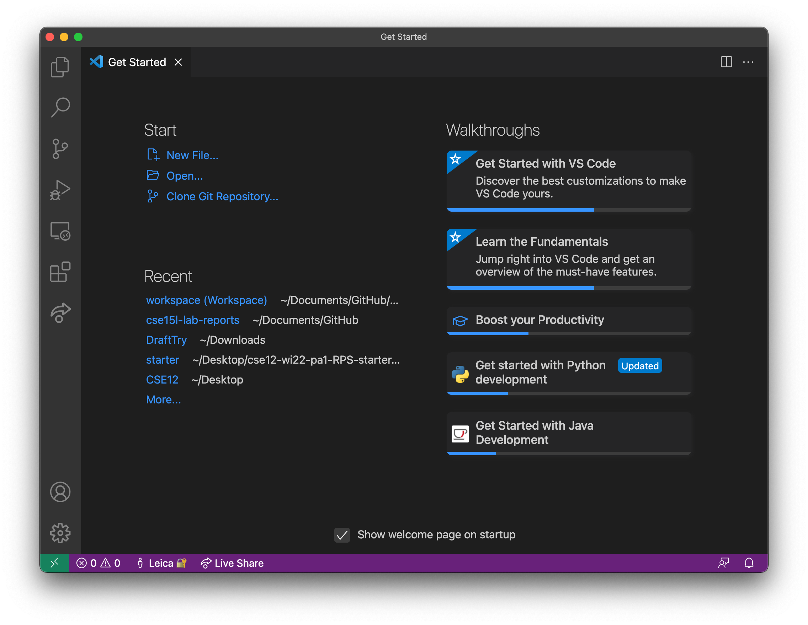
    - *VS Code after closing the welcome page.*
    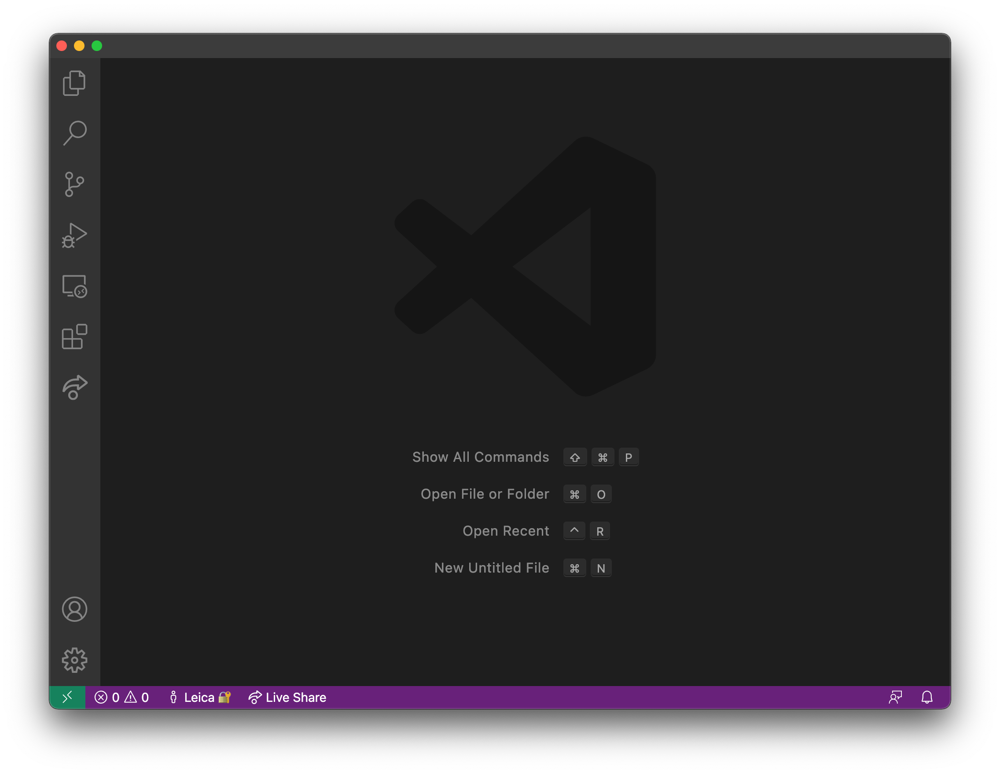


## Remotely Connecting
- Account lookup
    - On macbook, the first step is to look up your course-specific account on https://sdacs.ucsd.edu/~icc/index.php by following the instructions on the webpage.
- Open a terminal
    - In VSCode, use the shortcut (Ctrl + `) or click Terminal -> New Terminal on the top left menu bar.
    - Using the terminal on your macBook also works.
- Login on ssh
    - Type the command `ssh cs15lwi22ajd@ieng6.ucsd.edu` after the "$" symbol in the terminal.
        - `cs15lwi22ajd@ieng6.ucsd.edu` is my account for this course, yours should type in your account after `ssh `
    - Enter your password.
        - Characters you are typing in would not show up during this time.
        - Press enter/return key when you finish entering your password.
    - Your terminal should look like the images shown below after successfully logged in.
    - *Login on macOS terminal*
    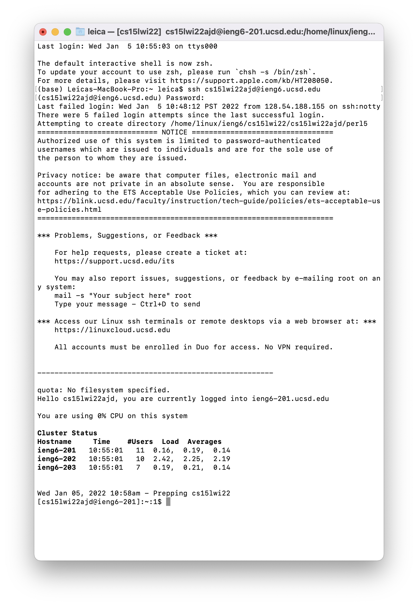
    - *Log in on VSCode terminal*
    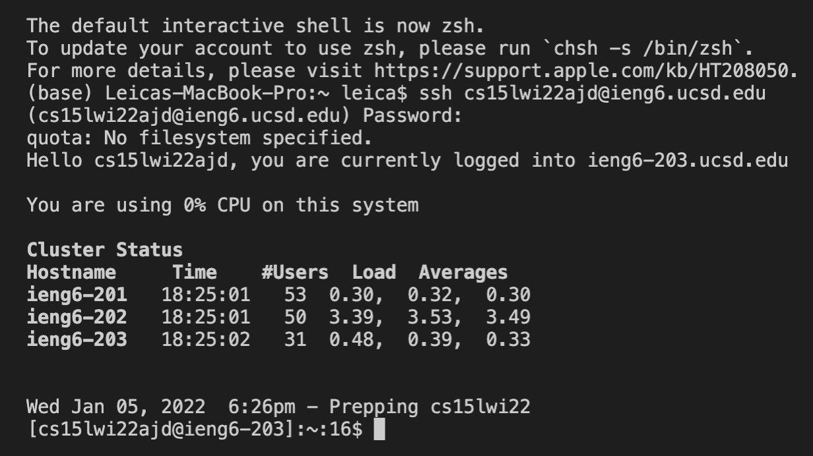
 
 
## Run Some Commands
- Here are some basic commands:
    - `pwd` prints working directory
    - `ls` lists files and directories under the current directory
    - `mkdir` makes a new directory
    - `cd` changes directory
    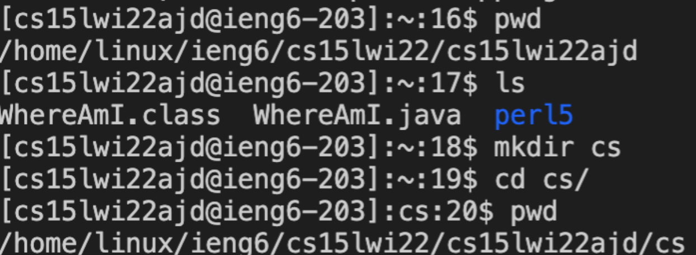
    - `exit` or Ctrl+D logs you out from the remote server
 
 
## Moving Files over SSH with `scp`
The command `scp` could copy files from your local computer to the remote server computer.
- First try to create a __WhereAmI.java__ file on your computer.
- Typing in the code:
    ```
    class WhereAmI {
        public static void main(String[] args) {
            System.out.println(System.getProperty("os.name"));
            System.out.println(System.getProperty("user.name"));
            System.out.println(System.getProperty("user.home"));
            System.out.println(System.getProperty("user.dir"));
        }
    }
    ```
    - It will print the operating system, user's name, user's home directory, and user's current directory in the console.
- Use `javac WhereAmI.java` to compile the program.
- Use `java WhereAmI` to run it.
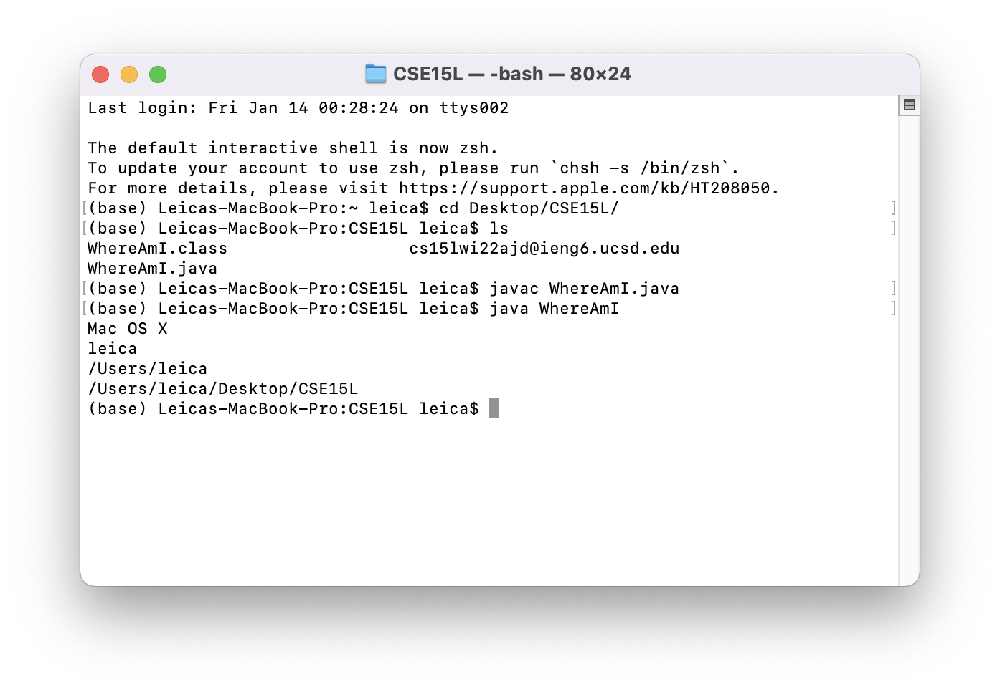
- In the terminal that you created WhereAmI.java, run `scp WhereAmI.java cs15lwi22ajd@ieng6.ucsd.edu:~/`
    - Notice that your account should be different from mine.
    - This command would allow you to copy your local file to the remote server, as shown below.
    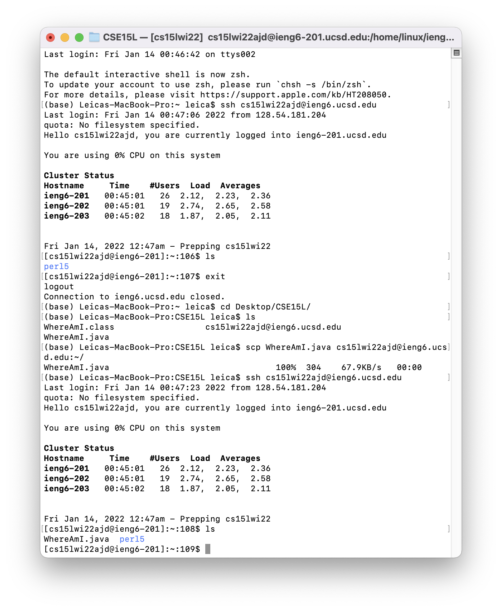
 
 
## SSH Keys
- On your computer, using command `ssh-keygen` to generate a pair of files: *public key* and *private key*.
    - It will ask you to enter a file to save the key, as shown below. I entered the same path shown in the ().
        - Since I have done it once, the file already exists, so it asks me "Overwrite (y/n)?"
    - It will then ask you to enter the passphrase which I left empty.
        - The characters you entered in the terminal would not show up during this time as well.
- After generating the key pairs, use the command `scp /Users/username/.ssh/id_rsa.pub cs15lwi22@ieng6.ucsd.edu:~/.ssh/authorized_keys` on __your computer__ to copy the public to the __.ssh__ directory on the remote server.
    - You could use `mkdir .ssh` on your __remote server__ to create the __.ssh__ directory if you don't have one yet.
    - You should replace the `username` by your username, and `cs15lwi22@ieng6.ucsd.edu` by your account.
    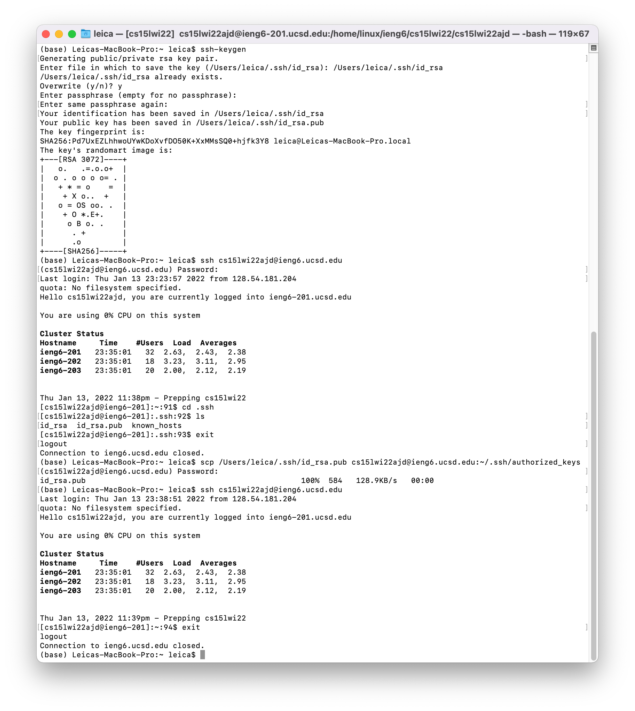
- After setting up the ssh keys, you could now login into your remote server from your computer without entering password each time as shown above.
 
 
## Optimizing Remote Running
- You can use the up-arrow key to use the previous command without re-typing anything to the terminal.
- You could also run several commands on the remote server in one command line by using `""` and `;`
    - At the end of `ssh` command, `""` could directly run the command in it on the remote server then exit.
    - `;` could let you run several commands in one line on the terminal.
    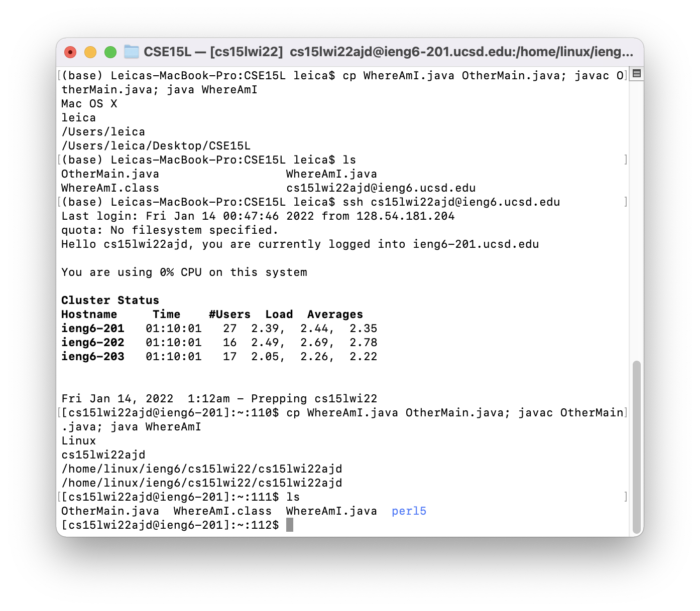
    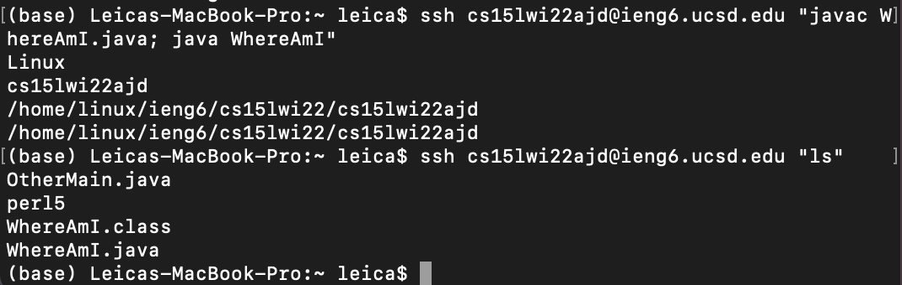
- Here is an example of using only two up-arrow keystrokes to run the new version of __WhereAmI.java__ on the remote server after edit and save it on my computer.
    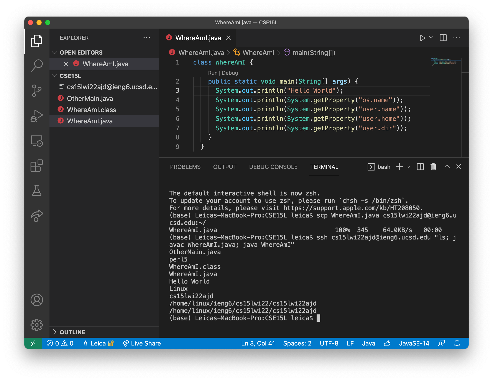