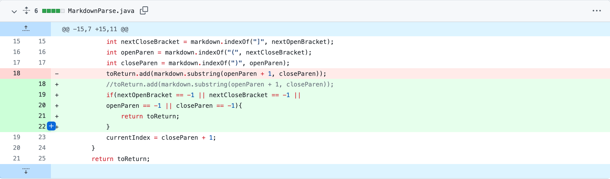
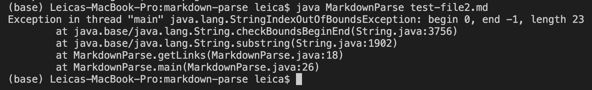
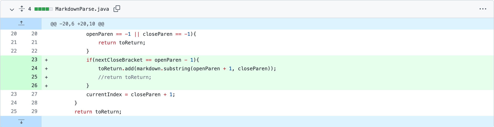
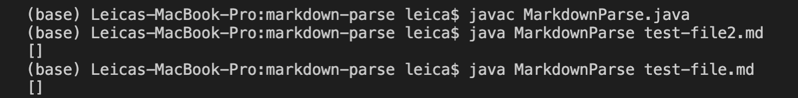
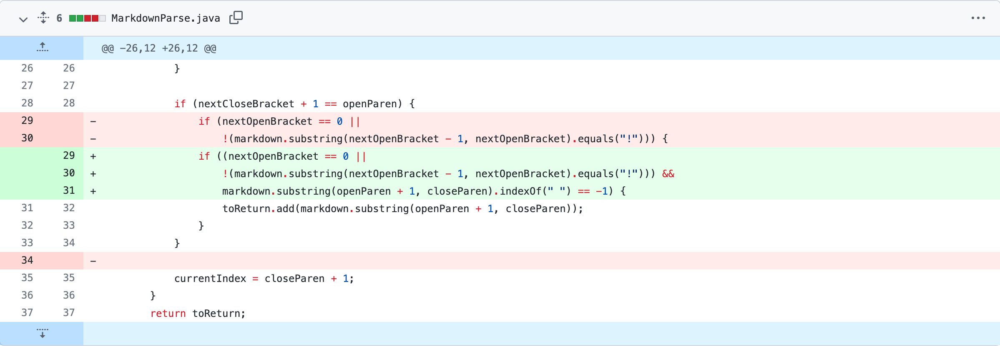
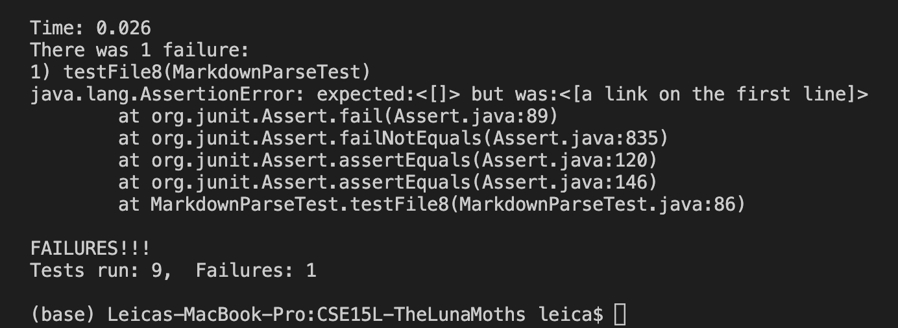

# Week 4 Lab Report

## Code Change 1 
- Screenshot of the code change diff
 
- Test file for a *failure-inducing input*
    - [test-file2](File/test-file2.md)
- *Symptom* of the *failure-inducing input* 
    - output of running the file at command line
    
- Relationship between the bug, the symptom, and the failure-inducing input in this case: 
    - The failure-inducing input is the input of [test-file2](File/test-file2.md). 
    - The symptom is that the code has `StringIndexOutOfBoundsException` exception. 
    - The bug is that the code `toReturn.add(markdown.substring(openParen + 1, closeParen))` did not consider the situation that there is no link in the markdown file so that the value of `openParen + 1` and `closeParen` would make the code invalid. 
    - The bug in code makes the code not work in the edge case, the failure-inducing input in the test file, causing the symptom of having exception as output. 

## Code Change 2
- Screenshot of the code change diff 

- Test file for a *failure-inducing input*
    - [test-file](File/test-file.md)
- *Symptom* of the *failure-inducing input* 
    - output of running the file at command line
    
- Relationship between the bug, the symptom, and the failure-inducing input in this case: 
    - The failure-inducing input is the input of [test-file](File/test-file.md). 
    - The symptom is that the code no longer work right for the original test file that contains links. 
    - The bug is that the code did not consider the case where the input contains valid links. It forget to add the valid links to the `toReturn` ArrayList. 
    - Since the bug cause the code not including the normal case input, the failure-inducing input in this case, the input contains valid links, would not work as expected. The links would not be returned so that the symptom of showing empty output in shown. 

## Code Change 3
- Screenshot of the code change diff 

- Test file for a *failure-inducing input*
    - [test-file8](File/test-file8.md)
- *Symptom* of the *failure-inducing input* 
    - output of running the file at command line
    
- Relationship between the bug, the symptom, and the failure-inducing input in this case: 
    - The failure-inducing input is the input of [test-file8](File/test-file8.md). 
    - The symptom is that it has an `AssertionError` in the MarkdownPareTest because the actual output has a "link" whereas the expected output is empty. 
    - The bug is that the code did not consider the case where the "contents" in the link format of markdown file `` is not a link. 
    - The bug in the code makes the code lack of consideration of the edge case input, the failure-inducing input in [test-file8](File/test-file8.md), so that when running the test, the symptom of showing `AssertionError` appears.