# Lab Report 4
## Snippet1
- Should produce 
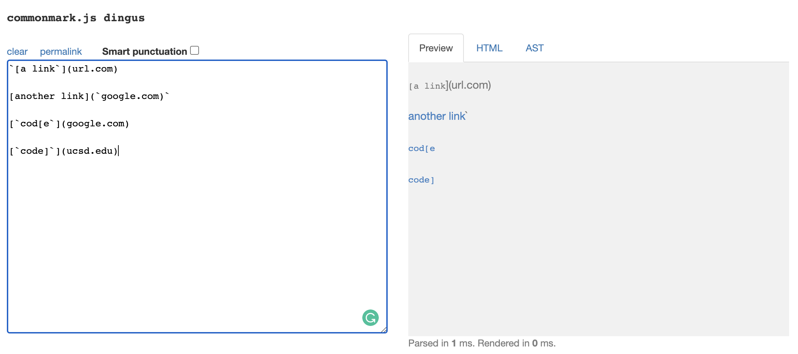
- Code in `MarkdownParseTest.java` 
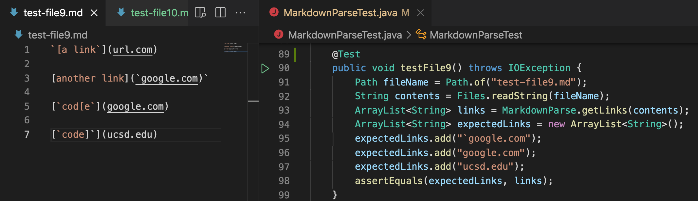
- My implementation
    - corresponding output when running the tests 
    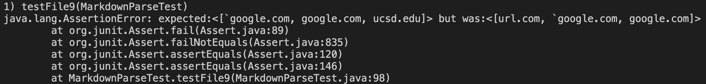
- The implementation I reviewed 
    - corresponding output when running the tests 
    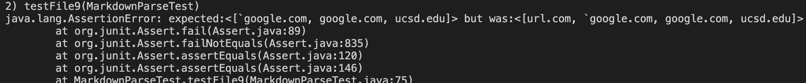
- Corresponding question of "Do you think there is a small (<10 lines) code change that will make your program work for snippet 1 and all related cases that use inline code with backticks?" 
    - I think that a small code change could make my program work for snippet1 and all related cases that use inline code with backticks. 
    - The code change is to add 2 local variables that trace the pairs of __\`\`__, and the code could check the positions of the squarly brackets`[]` or parenthesis`()` relative to "__\`__" 's by using `if` statements to check the indices. Then consider different cases of when the link should be add to the `ArrayList`. 
## Snippet2 
- Should produce 
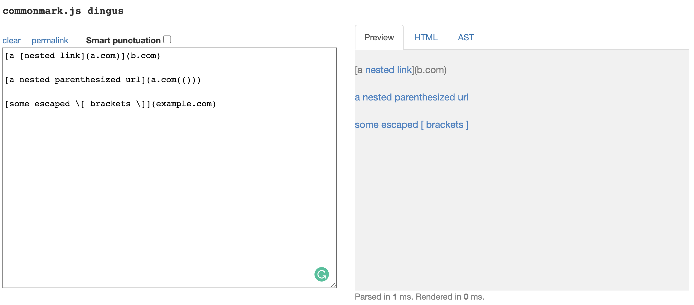
- Code in `MarkdownParseTest.java` 
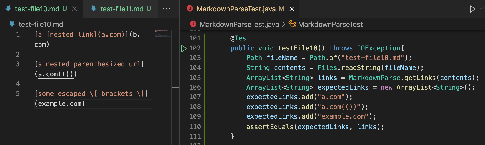
- My implementation
    - corresponding output when running the tests 
    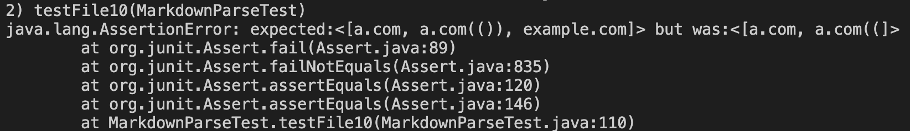
- The implementation I reviewed 
    - corresponding output when running the tests 
    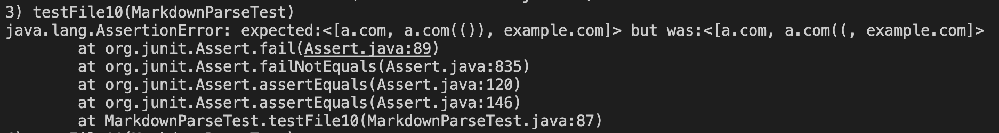
- Corresponding question of "Do you think there is a small (<10 lines) code change that will make your program work for snippet 2 and all related cases that nest parentheses, brackets, and escaped brackets?" 
    - I don't think that a small code change could make my program work for snippet 2 and all related cases that use nest parentheses.
    - Since the way our code get all the valid links are by tracing indices of squarely brackets`[]` and parentheses`()`, the nested parentheses could cause our program lost. In order to make the output of snippet 2 and all the related cases right, we need to match each pair of parentheses to figure out which parentheses are within the link and which parenthese are the ones outside the link that act like texts in file, so we need to consider different cases of compositions of `()`, which could take more than 10 lines to make the program run right and successfully. 
## Snippet3 
- Should produce 
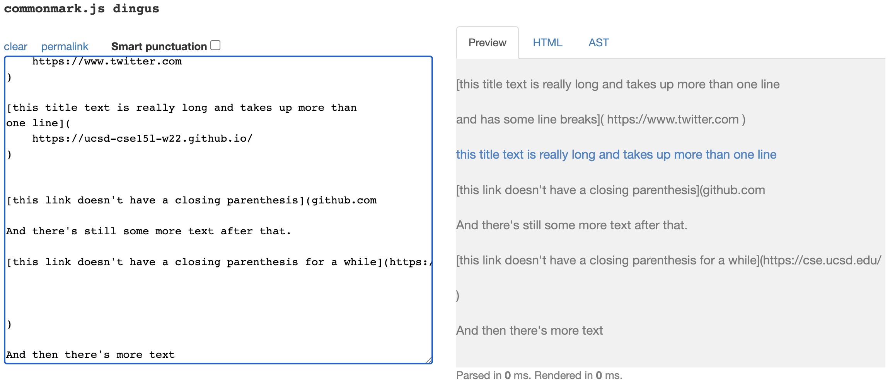
- Code in `MarkdownParseTest.java` 
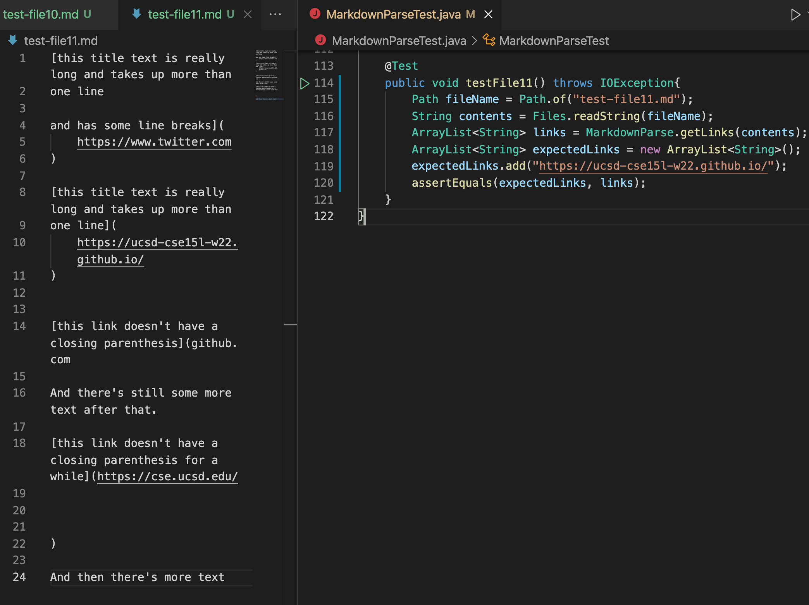
- My implementation
    - corresponding output when running the tests 
    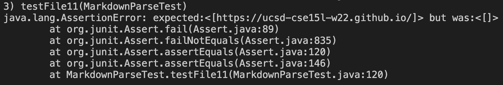
- The implementation I reviewed 
    - corresponding output when running the tests 
    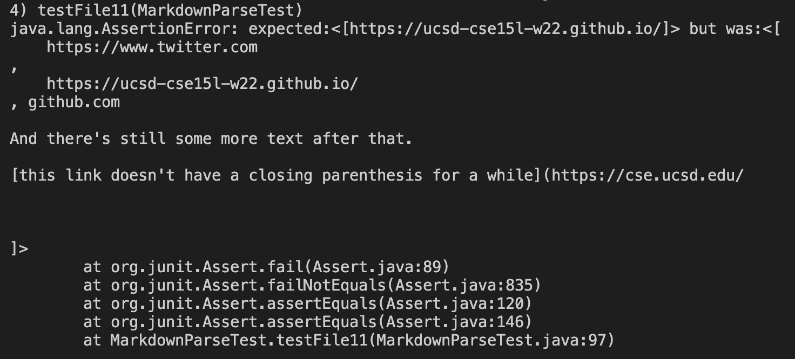
- Corresponding question of "Do you think there is a small (<10 lines) code change that will make your program work for snippet 3 and all related cases that have newlines in brackets and parentheses?" 
    - I think that a small code change could make my program work for snippet 3 and all related cases that have newlines in brackets and parentheses.
    - Since our code retrieves the links by tracing and using indices of brackets`[]` and parentheses`()`, it could successfully trace the links in snippet3 by using this method. Since it do not consider the contents between `()` that has spaces `' '` in between as links, it  excludes the case that the content between `()` that has spaces. However, it is possible to make it works by changing the condition in `if` statement from excluding the case that the content between `()` has spaces `' '` to excluding the case that the contexts/texts in the content between `()` to have spaces`' '`. 
