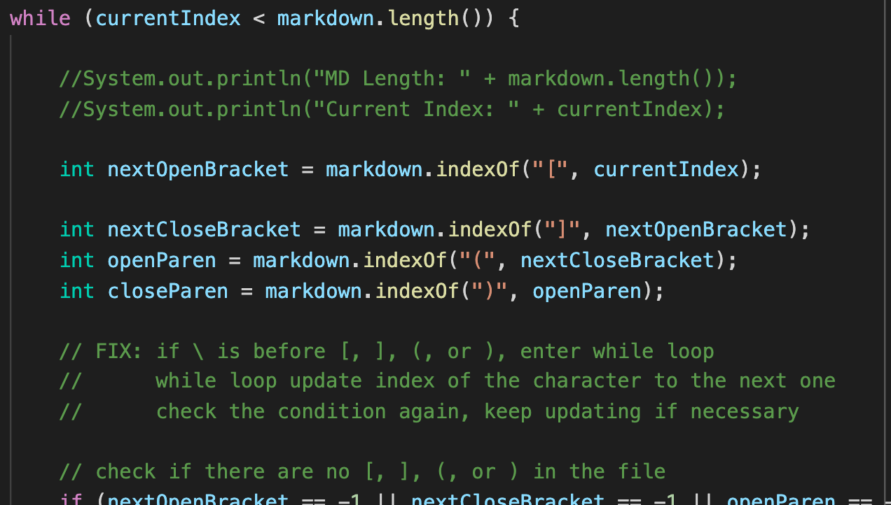

# Lab Report 5
- How you found the tests with different results? 
    - I used `diff` on the results of running a bash for loop. 
    - I added `echo $file` in the for loop to print name of each file when running and adding output to the `results.txt`, then use command `diff CSE15L-TheLunaMoths/results.txt markdown-parse/results.txt` to compare the results from the provided implementation and my implementation of `markdown-parse`

- Test1: 
    - `579.md`
        - 
    - Different: 
        - 
    - Expected Output: 
        - 
    - My output: 
        - 
    - Provided's output:
        -  
    - My implementation is correct and the provided implementation is not. As shown above, the expected output does not contain any link. 
    - The Bug: 
        - In the test file `579.md`, the `![]` means it will display an image instead of a link, but the provided implementation does not consider this situation where the `` after `!` would generate image instead of link. 
    - The Fix: 
        - In order to fix this bug, the program should add an local `int` variable to trace the index of `!` as well. Then using the `if` statement to see whether the open bracket's index `[` is right after `!`'s index. By comparing those two indices, the program could then know whether it is a link or an image.  
        - The code that should be fixed is commented shown below
        

- Test2: 
    - `497.md`
        - 
    - Different: 
        - 
    - Expected Output: 
        - 
        - 
    - My output: 
        - 
    - Provided's output:
        -  
    - Both implementation are not correct. As shown above, the expected output should be a link `foo(and(bar)`, but the provied implementation's output does not contain any link, and my output contains the wrong link that has several extra `\`. 
    - The Bug of my implementation: 
        - The `\` "could display a literal character that would otherwise be used to format text in Markdown." Thus, `\(` and `\)` in this nested parentheses in the link actually means to display `(` or `)`, but my implementation does not consider this situation, it just simply get the indices of `(` and `)` to get the link. 
    - The Fix: 
        - In order to fix this bug, I should add a `while` loop with condition checking whether the character right before the `(` or `)` is the backslash `\` which could escape characters. If the condition is true, the body of the `while` loop then updates the index of `(` or `)` to the next one. The `while` loop would make sure that the result index of `(` or `)` I get would have no `\` right before it. 
        - Besides adding a while loop, I should also consider the `\` situation when add the link to the `toReturn` ArrayList since the link might be different than the content within `()` in the `.md` file. 
        - The code that should be fixed is commented shown below 
         and 
        